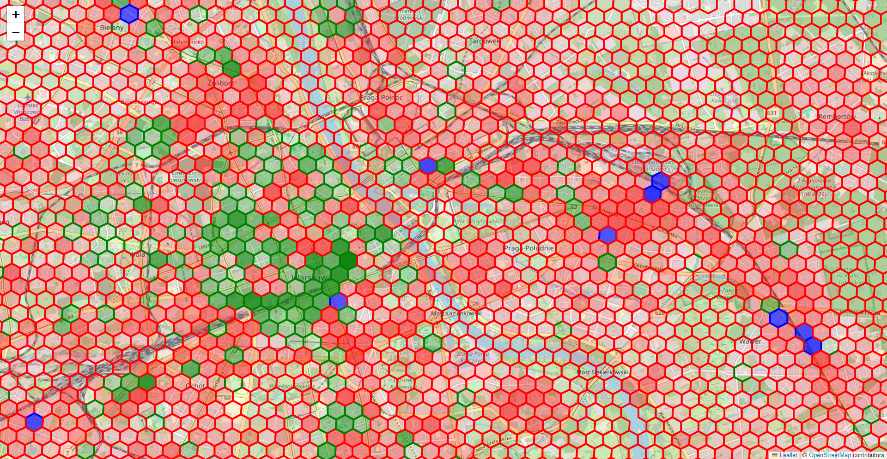

## Respository for storing the OSM OHCA location prediction model and deployment pipeline

This repository contains the code for the OSM OHCA location prediction model. The model uses [H3](https://h3geo.org/) to create a hexagonal grid over training data and uses a [H2O](https://www.h2o.ai/) AutoML regressor to predict the count of OHCA incidents in provided hexagons.

Preview 😊



## Prerequisites for running the deployment pipeline

- [Python 3.11](https://www.python.org/downloads/)
- Java 8 or higher

For building neighbourer, the program that adds neighbour data to hexagons, you will also need:

- [H3](https://github.com/uber/h3/releases/tag/v4.1.0) version 4.10 (C library)
- [CMake](https://cmake.org/)

## Running the deployment pipeline

Install python dependencies:

```bash
pip install -r requirements.txt
```

The deployment goes through the following steps:

1. [aquire_data.py](./aquire_data.py) - Downloads and saves case data as two files - `osm_data.csv` with data about the terrain features and `warszawa_osm.csv` into the [data](./data) directory from:
- The [Overpass API](https://wiki.openstreetmap.org/wiki/Overpass_API) for Data about terrain features
- [VBOHCA](https://github.com/janielecustodio/VBOHCA) - Spatiotemporal Data Set for Out-of-Hospital Cardiac Arrests in Virginia Beach
- [Cincinnati Fire Incidents (CAD) (including EMS: ALS/BLS)](https://data.cincinnati-oh.gov/Safety/Cincinnati-Fire-Incidents-CAD-including-EMS-ALS-BL/vnsz-a3wp/data)
- [Police Dispatched Incidents, Montgomery County, MD](https://data.montgomerycountymd.gov/Public-Safety/Police-Dispatched-Incidents/98cc-bc7d/about_data)

2. [create_main_df.py](./create_main_df.py) - Creates two dataframes, one for training and one for testing, and saves them into the [data](./data) directory, their names are `main_hexagon_df.csv` and `target.csv`. It also uses the neighbourer - a program that sums values of neighbours for every hexagon and adds appropriate columns. The program is written in C++ and uses the H3 library.

3. [train_model.py](./train_model.py) - Trains the model and saves it into the [models](./models) directory

4. [predict.py](./predict.py) - Uses the `target.csv` file to predict the count of OHCA incidents in each hexagon and saves the result into the [data](./data) directory as `predictions.csv`

5. [visual.py](./visual.py) - Creates a map of the predictions and saves it into the [data](./data) directory as `map.html`

## Performance

The best model ***currently*** achieves a root mean squared error of 0.91 on predicting the number of ohca cases in a hexagon across 3 years on the whole dataset.

## Special thanks

We would like to send special thanks to people and organizations that have shared data that powers our model 🤗. We also encourage other local goverments to share their data in accessible ways for research and open source projects!

- The city of [Virginia Beach](https://www.vbgov.com/Pages/default.aspx) and the creators of [VBOHCA](https://github.com/janielecustodio/VBOHCA)
- The city of [Cincinnati](https://data.cincinnati-oh.gov/)
- [Montgomery County](https://www.montcopa.org/)
- The [County of Berks](https://opendata.countyofberks.com/)


## Authors

- [Radosław Dąbkowski](https://github.com/radekaadek)
- [Michał Ambroży](https://github.com/michalambro89)
- [Koło Naukowe Geoinformatyki]((https://github.com/KN-GI))
